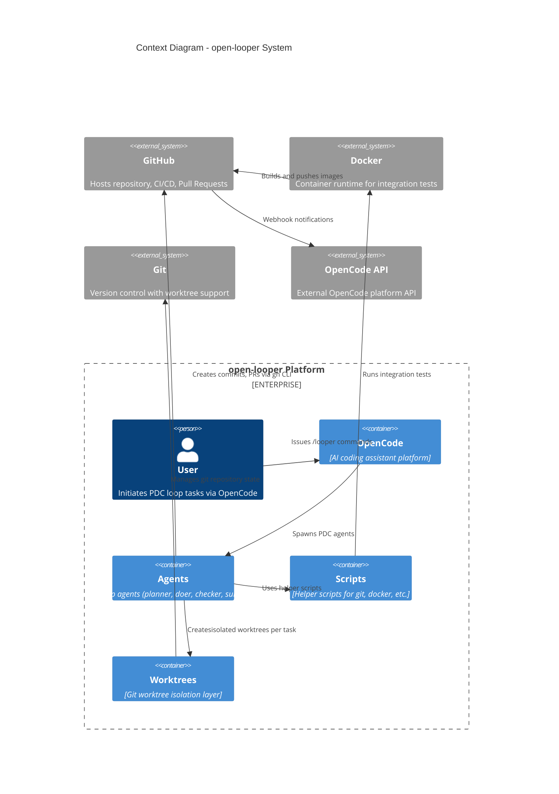

# Context Diagram (L1)

## open-looper System Context

## Legend

| Element | Description |
|---------|-------------|
| **Person** | Human actors (User) |
| **Container** | Applications or data stores within the system |
| **System_Ext** | External systems outside the open-looper boundary |
| **Enterprise_Boundary** | Groups elements belonging to the same platform |

## External Dependencies

- **GitHub**: Repository hosting, CI/CD pipelines, PR creation via `gh` CLI
- **Docker**: Integration test execution, container builds
- **Git**: Worktree management, commit history
- **OpenCode API**: External platform for webhook events

## Key Interactions

1. User issues a `/looper <task>` command via OpenCode
2. OpenCode spawns the Planner → Doer → Checker cycle
3. Agents create git worktrees for isolated development
4. Helper scripts manage Docker containers for integration tests
5. Commits and PRs are pushed to GitHub via `gh` CLI
